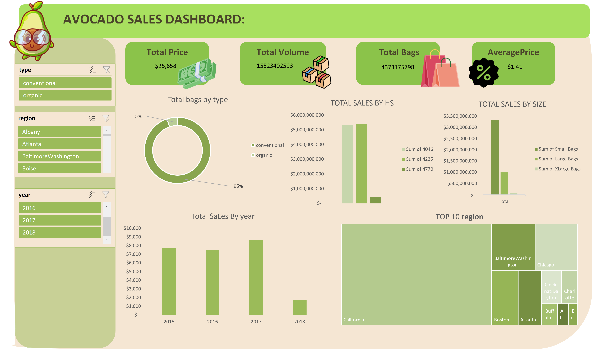

# 🥑 Avocado Sales Dashboard

## 📌 Project Overview
This project analyzes avocado sales data to understand sales performance, customer demand, product types, and regional trends.

The dashboard provides interactive insights about total sales, volume, bags, average price, and avocado market performance over different years and regions.

---

## 📊 Dashboard Preview

---

## 🎯 Objectives
- Analyze avocado sales performance
- Compare conventional and organic avocado sales
- Understand sales trends over years
- Identify top performing regions
- Analyze sales by bag size
- Track pricing behavior

---

## 🛠 Tools Used
- Microsoft Excel
- Data Cleaning
- Pivot Tables
- Charts
- Dashboard Design
- Data Visualization

---

## 📈 Key Insights

- Total sales price reached **$25,658**
- Total avocado volume analyzed: **1.55B+**
- Conventional avocado type represents the majority of sales
- Sales performance varies across different regions
- California is one of the top regions by sales volume
- Different bag sizes contribute differently to total sales
- Yearly sales trends show changes in avocado demand

---
## 🔍 Dashboard Features

### KPIs:
- Total Price
- Total Volume
- Total Bags
- Average Price

### Visualizations:
- Sales by avocado type
- Sales by bag size
- Sales by year
- Top regions analysis
- Regional sales distribution
- Interactive filters

## 📂 Project Structure
